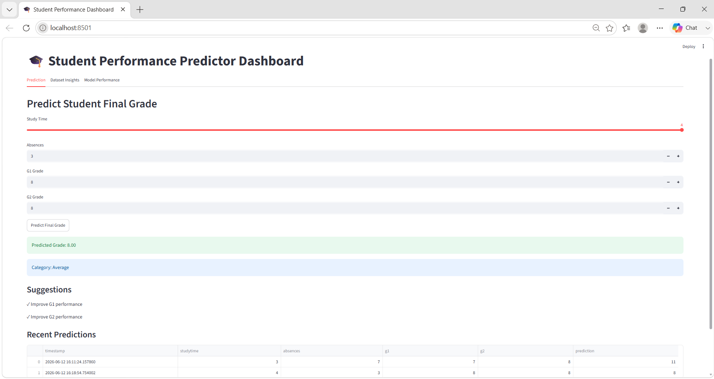
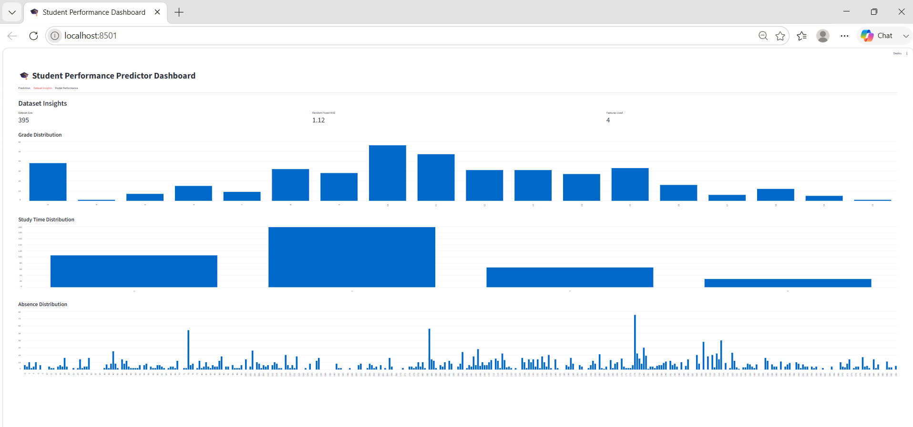
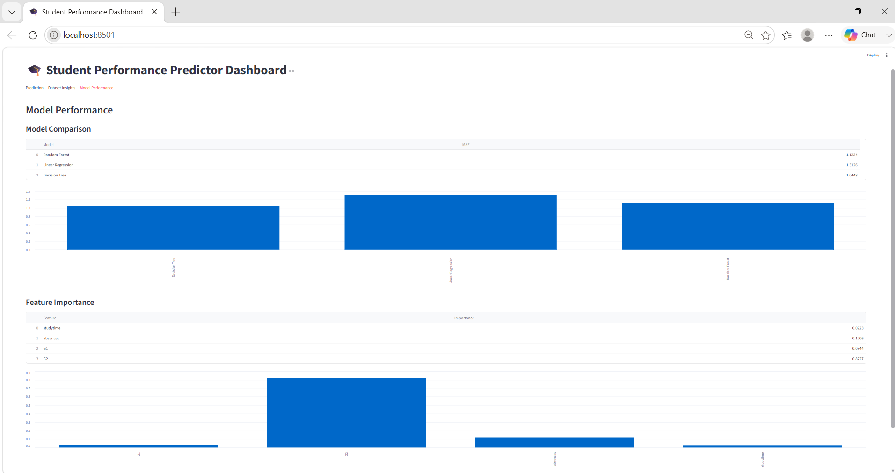

# 🎓 Student Performance Predictor Dashboard

Predict student final grades using Machine Learning with an interactive Streamlit dashboard featuring model comparison, feature importance, analytics, recommendations, and prediction history.

---

## 📖 Overview

This project predicts a student's final grade (**G3**) based on academic performance and study habits using Machine Learning models.

The application compares multiple algorithms, explains predictions through feature importance, and provides actionable recommendations for improvement.

---

## ✨ Features

### 🔹 Predict Final Grades

Input:

* Study Time
* Absences
* G1 Grade
* G2 Grade

Output:

* Predicted Final Grade
* Grade Category
* Personalized Recommendations

### 🔹 Model Comparison

Compare the performance of:

* Random Forest Regressor
* Linear Regression
* Decision Tree Regressor

### 🔹 Feature Importance

Visualize which features contribute most to predictions.

### 🔹 Dataset Insights Dashboard

Includes:

* Grade Distribution
* Study Time Distribution
* Absence Distribution
* Metrics Cards

### 🔹 Grade Categorization

| Grade Range | Category  |
| ----------- | --------- |
| 0 - 7       | Poor      |
| 8 - 11      | Average   |
| 12 - 15     | Good      |
| 16 - 20     | Excellent |

### 🔹 Personalized Recommendations

Example suggestions:

* Increase study time
* Reduce absences
* Improve G1 performance
* Improve G2 performance

### 🔹 Prediction History

Stores and displays previous predictions for tracking and analysis.

---

## 🛠 Tech Stack

| Category             | Technology          |
| -------------------- | ------------------- |
| Programming Language | Python              |
| Machine Learning     | Scikit-Learn        |
| Data Processing      | Pandas, NumPy       |
| Visualization        | Matplotlib, Seaborn |
| Frontend             | Streamlit           |
| Version Control      | Git, GitHub         |

---

## 📂 Project Structure

```text
StudentPerformancePredictor/
│
├── app.py
├── train.py
├── requirements.txt
├── README.md
├── prediction_history.csv
│
├── data/
│   └── student-mat.csv
│
├── models/
│   ├── model.pkl
│   ├── model_comparison.csv
│   └── feature_importance.csv
│
└── .github/
    └── workflows/
        └── python.yml
```

---

## ⚙️ Machine Learning Pipeline

1. Load dataset
2. Encode categorical variables
3. Feature selection
4. Train/Test split
5. Train multiple regression models
6. Evaluate models using MAE
7. Save best-performing model
8. Deploy through Streamlit

---

## 📊 Model Comparison

| Model                   | MAE  |
| ----------------------- | ---- |
| Random Forest Regressor | 1.12 |
| Linear Regression       | 1.31 |
| Decision Tree Regressor | 1.04 |

The best-performing model is automatically saved as:

```text
models/model.pkl
```

---

## 🏗 Architecture

```text
Student Data
      │
      ▼
Preprocessing
      │
      ▼
Model Training
(Random Forest / Linear Regression / Decision Tree)
      │
      ▼
Model Evaluation
      │
      ▼
Best Model Saved
(model.pkl)
      │
      ▼
Streamlit Dashboard
      │
      ▼
Prediction & Recommendations
```

---

## 🚀 Setup Instructions

### 1️⃣ Clone Repository

```bash
git clone https://github.com/your-username/student-performance-predictor.git
cd student-performance-predictor
```

### 2️⃣ Create Virtual Environment

Windows:

```bash
python -m venv venv
venv\Scripts\activate
```

Linux/Mac:

```bash
python -m venv venv
source venv/bin/activate
```

### 3️⃣ Install Dependencies

```bash
pip install -r requirements.txt
```

### 4️⃣ Train Models

```bash
python train.py
```

### 5️⃣ Run Streamlit App

```bash
streamlit run app.py
```

---

## 📈 Dashboard Pages

### Prediction

* Predict final grades
* Grade categorization
* Personalized recommendations
* Prediction history

### Dataset Insights

* Dataset statistics
* Grade distribution
* Study time analysis
* Absence analysis

### Model Performance

* Model comparison
* Feature importance visualization

---

## 🔮 Future Improvements

* Correlation Heatmap
* Hyperparameter Tuning
* Docker Deployment
* GitHub Actions CI/CD
* AI Study Advisor
* Cloud Deployment

---

## 📸 Screenshots
<h3>Prediction Dashboard</h3>
<p align="center">
  
</p>

<h3>Dataset Insights</h3>
<p align="center">
  
</p>

<h3>Model Performance</h3>
<p align="center">
  
</p>

---

## 👨‍💻 Author

Reshmitha Srihasini

Computer Science Engineering Student

Interested in:

* Machine Learning
* AI
* Web Development
* Software Development

---